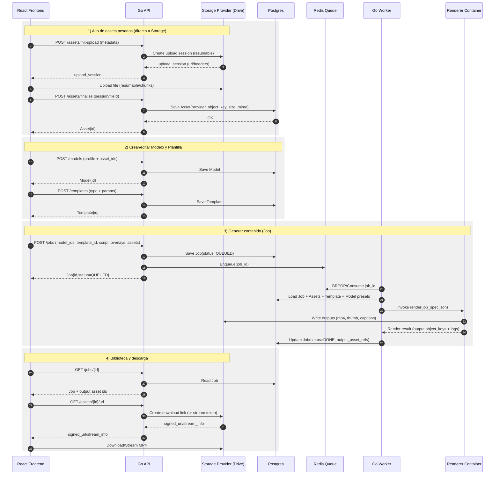
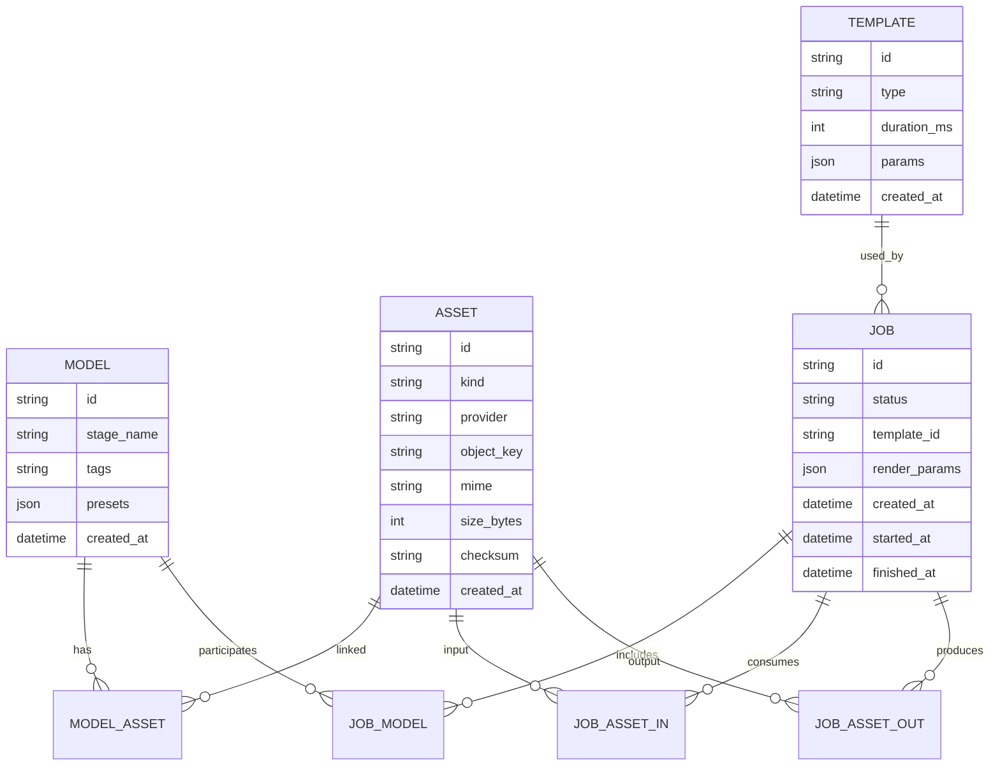

## Diagrama de componentes

```mermaid
flowchart LR
  U[Usuario] -->|UI| FE[Frontend\nReact (minimal)]
  FE -->|REST| API[Backend API\nGo]

  API --> DB[(Postgres)]
  API --> Q[(Redis Queue)]

  W[Worker\nGo] -->|consume jobs| Q
  W -->|invoke render| R[Renderer Container\nFFmpeg + pipeline]
  R -->|store outputs| SP[Storage Provider\nGoogle Drive (init)\nSwappable: S3/GCS/MinIO]
  API -->|init/finalize upload\nget URLs| SP

  FE -->|direct upload (preferred)| SP
  FE -->|poll job status| API
  FE -->|stream/signed URL| API
  API -->|signed URL / proxy stream| SP

  subgraph Docker Local
    FE
    API
    DB
    Q
    W
    R
  end

  subgraph External
    SP
  end
```

---

## Flujo end-to-end (secuencia)



---

## Diagrama de datos (ERD conceptual)


